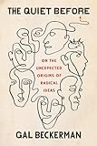
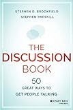
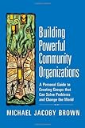
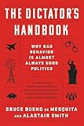
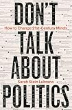
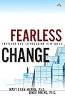

# Conclusion

## Things We Didn't Cover

-   Change in a time of crisis
    -   The K-T Event gave mammals their chance, but was bad news for the dinosaurs
-   Fatigue and burnout
    -   Watch for early warning signs
    -   Don't be ashamed to ask for help
    -   Be kind to each other
-   Persuading people
    -   "It is not enough to be right: one must be heard."
-   See [the bonus material](../bonus/index.qmd)

## What to Read Next

  

  

  

  

  

  

## Retrospective

-   Software Carpentry
    -   Has helped tens of thousands of people over 15 years
    -   But hasn't become a normal part of the curriculum
        1.  "We will teach you to program so you can do better research faster"
        2.  "We will teach you how to teach so you can help your colleagues do the same"
        3.  "We will teach you how to organize so that you can make this normal"
    -   In retrospect, should have made the third step explicit:
    -   It's never too late…
-   Whatever you decide:
    -   Start where you are
    -   Use what you have
    -   Help who you can

## Exercises

### Retrospective

1.  What is the single most useful, interesting, or surprising thing you learned in this workshop?
1.  What was included that you don't think you will find useful?
