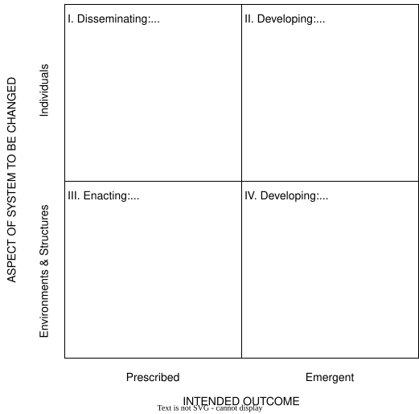

# Goals, Strategies, and Tactics

## Terminology

-   A  is something you want to accomplish
    -   "Make research fairer, more reliable, and more efficient"
-   A  is a long-term plan to achieve that
    -   "Increase institutional and individual adoption of open science"
-   A  is a specific action that fits into a larger strategic plan
    -   "Give researchers credit in performance reviews for creating open-access data sets"
-   Over time, people often confuse strategies with goals
    -   Open science isn't the goal: fairness, reliability, and efficiency are
-   ...and focus too narrowly on the tactics, losing sight of how they conflict with or contradict each other within the overall strategy

## A Simple Conceptual Framework

-   [@Borrego2014] looked at how to increase adoption of evidence-based teaching strategies in STEM
    -   Prescribed (top-down) vs. emergent (bottom-up)
    -   Environments and structures (the system) vs. individuals

  

## A Little Philosophy

-   [Isaiah Berlin](@berlin-isaiah) defined [two concepts of liberty](@berlin-liberty)
    -    is freedom *from*,
        i.e., there's no rule that says you can't do something
    -    is freedom *to*,
        i.e., you have the means and ability to pursue a goal
-   Those with power will often cede negative liberty without supporting positive liberty
-   Berlin and others also showed that absolute rights often conflict
    -   E.g., freedom of speech vs. freedom from harassment
-   Easy to say "find a balance", but much harder to agree on what that balance *is*
-   Reform movements often tie themselves in knots over this
    -   Deny the conflict
    -   Try to formulate precise rules in advance
-   Two kinds of knowledge [@Scott1998]
    -    is hard-and-fast rules, often derived from first principles
    -    "can be acquired only by long practice at similar but rarely identical tasks
        [and] requires constant adaptation to changing circumstances"
    -   Scientists and programmers want techne; organizational change requires metis

## Sabina's Goals and Strategy

-   Sabina's goal is to enable people to devote working hours to open source projects and DEI initiatives
-   She doesn't believe there is support for making either mandatory,
    so her strategy is to have both added to the performance review guidelines at her company
    as things that people can get credit for
-   Sabina therefore fits in the *Prescribed* - *Environments & Structures* quadrant
    of Borrego and Henderson's classification
-   Her next step is to pick tactics

## Exercises

### Identify Goals, Strategies, and Tactics

In order to discourage researchers from  their papers,
your university has decreed that people can only submit one paper per year
for consideration by the promotion committee.

1.  Identify goals, strategies, and tactics in the statement above.
1.  Identify (at least) three ways in which this proposal can go wrong.

### Choosing an Approach

1.  Which of these options do you think will work best in your environment?
1.  Which are you most comfortable with?

### The Right Kind of Knowledge

1.  Describe the last time you tried to apply *techne* when the situation required *metis*.
1.  What have you learned in your current role that qualifies as *techne*? As *metis*?
